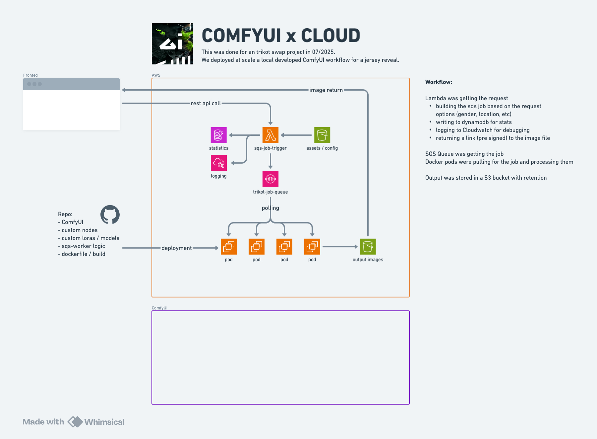

# ComfyUI x Cloud  
**Trikot Swap Workflow – Jersey Reveal, 07/2025**



---

## Overview

This project deploys a scalable, cloud-based ComfyUI workflow for automated image processing. Built for a high-volume trikot swap campaign, it leverages AWS Lambda, SQS, Docker, and S3 for distributed inference and robust queue-based orchestration.

---

## Architecture

- **Frontend**: Sends REST API requests for image generation.
- **Lambda**: Handles API requests, builds SQS jobs, logs stats, and returns pre-signed image URLs.
- **SQS**: Queues jobs for processing.
- **Docker Pods (EC2 G6)**: Poll jobs, run ComfyUI, and write results to S3.
- **S3**: Stores output images and assets/configs.

See the diagram above for a full workflow overview.

---

## Quickstart

### 1. Requirements

- EC2 G6 instance with GPU (NVIDIA)
- IAM role with S3 access permissions
- Replicate API Token
- Docker installed

### 2. Setup

#### 2.1. Set Replicate Token

```bash
export REPLICATE_API_TOKEN=<paste-your-token-here>
```

#### 2.2. Clone the Repository

```bash
git clone https://github.com/<your-org>/lbbw-trikot-sqs-worker-enhanced-workflow.git
cd lbbw-trikot-sqs-worker-enhanced-workflow
git checkout sqs-worker-enhanced-workflow
```

#### 2.3. Build Docker Image

```bash
./builder.sh
```

#### 2.4. Test Run (Locally)

```bash
./runbaby.sh
```

#### 2.5. Orchestrate/Deploy Multiple Pods

```bash
./orchestrator.sh
```

---

## Scripts

### builder.sh

Builds the Docker image with all dependencies, custom nodes, LoRAs, and models.

```bash
# Usage
./builder.sh
```

### runbaby.sh

Runs a single test instance of the ComfyUI worker for local development or debugging.

```bash
# Usage
./runbaby.sh
```

### orchestrator.sh

Manages the orchestration and scaling of multiple Docker pods for processing jobs from SQS in parallel.

```bash
# Usage
./orchestrator.sh
```

---

## Deploying New Pods

To deploy a new processing pod (worker), simply:

1. Start a new EC2 G6 instance with GPU.
2. Attach an IAM role with access to your S3 bucket(s).
3. Set the Replicate API token:

   ```bash
   export REPLICATE_API_TOKEN=<paste-your-token-here>
   ```

4. Clone this repository and switch to the correct branch:

   ```bash
   git clone https://github.com/<your-org>/lbbw-trikot-sqs-worker-enhanced-workflow.git
   cd lbbw-trikot-sqs-worker-enhanced-workflow
   git checkout sqs-worker-enhanced-workflow
   ```

5. Build and launch:

   ```bash
   ./builder.sh
   ./runbaby.sh  # For single worker
   # or
   ./orchestrator.sh  # For orchestrated/multi-worker
   ```

---

## Repo Contents

- **ComfyUI** (core and custom nodes)
- **Custom LoRAs / models**
- **SQS worker logic**
- **Dockerfile and build scripts**

---

## Workflow Summary

- Lambda builds and submits jobs to SQS.
- Docker workers poll SQS, process jobs, and upload results to S3.
- Results are returned via pre-signed S3 URLs.

---

## Credits

Architecture & Implementation: Markus Frank  

---

**Tip:** Adjust repo URLs and add any further details about environment variables, scaling, or special configuration as needed.
